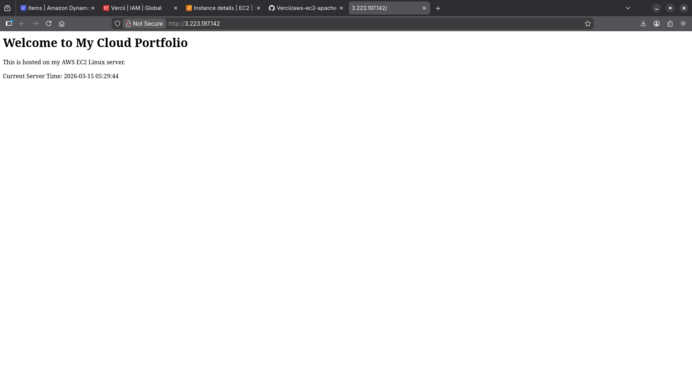

# aws-ec2-apache-web
This repository contains the files and documentation for my cloud website hosted on AWS EC2.  
The website is built using **Apache** and **PHP** and demonstrates a simple dynamic page showing the server time.

## About

This project is a hands-on example of deploying a cloud-based web server.  
It includes:

- Launching an EC2 instance on AWS  
- Installing and configuring Apache and PHP
- Managing website files in `/var/www/html`  
- Using Elastic IPs for a permanent public link  
- Security group configuration to allow HTTP access  

## Files in This Repository

- `index.php` – Main PHP page for the portfolio site  
- `notes/commands.md` – Step-by-step command-line notes and explanations  
- `notes/console.md` – Step-by-step AWS Management Console notes  

## Screenhot

